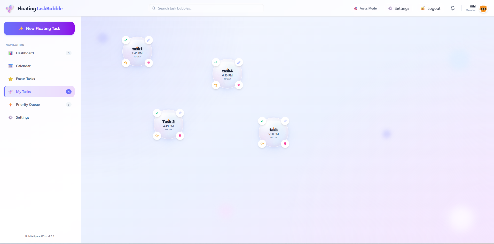
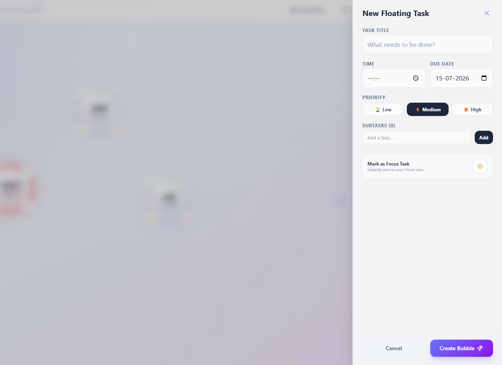
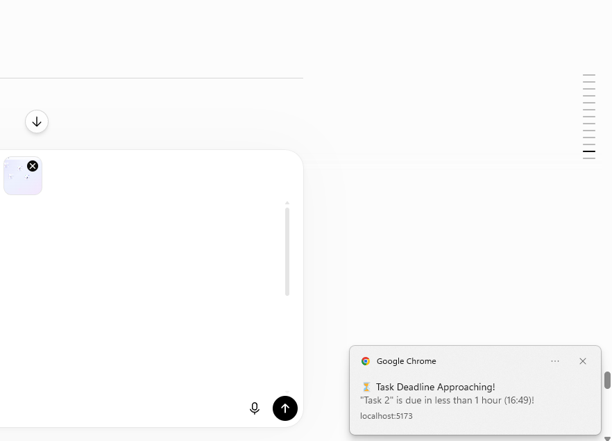

# 🫧 Floating Task Bubble

<p align="center">
  <h3 align="center">Stay Organized with Interactive Floating Bubbles</h3>

  <p align="center">
    A visual productivity system that transforms traditional task management into interactive floating bubbles.
  </p>
</p>

---

## 📌 About the Project

**Floating Task Bubble** is a productivity application built with React, Vite, Tailwind CSS, and Framer Motion.

Instead of displaying tasks in boring lists, the application represents each task as an interactive floating bubble. Users can create, edit, organize, and manage tasks visually.

The long-term goal is to connect the web application with an Electron desktop app so that task bubbles can float directly on the desktop.

---

## ✨ Features

### ✅ Implemented Features

- User authentication system
- Create new tasks
- Edit existing tasks
- Delete tasks
- Add subtasks
- Focus mode
- Search tasks
- Priority queue
- Calendar view
- Desktop mode UI
- Notification reminders
- Dark mode support
- Settings page
- Local data storage
- Interactive floating bubbles
- Responsive dashboard

---

## 🖼️ Project Preview

### Dashboard

- Floating task bubbles
- Search bar
- Sidebar navigation
- Calendar integration
- Priority filtering

### Task Bubble Features

Each bubble displays:

- Task title
- Due date
- Task time
- Priority level
- Completion status
- Focus mode state
- Edit button
- Delete button

---

## 🛠️ Tech Stack

| Technology | Purpose |
|------------|----------|
| React | Frontend framework |
| Vite | Development environment |
| Tailwind CSS | Styling |
| Framer Motion | Animations |
| Electron | Desktop application (in progress) |

---

## 📂 Project Structure

```bash
src/
│
├── components/
│   ├── bubbles/
│   ├── layout/
│   ├── modals/
│
├── pages/
│
├── data/
│
├── utils/
│
├── assets/
│
└── App.jsx
```

---

## 🚀 Installation

Clone the repository:

```bash
git clone https://github.com/Tithi-glb/Floating-Task-Bubble.git
```

Move into the project:

```bash
cd Floating-Task-Bubble
```

Install dependencies:

```bash
npm install
```

Run the project:

```bash
npm run dev
```

Open:

```text
http://localhost:5173
```

---
# 📸 Project Screenshots

## Dashboard



## Add Task Panel



## Notifications


---

## 🔔 Notification System

The application currently supports:

- Browser notifications
- Task reminders
- Due-time alerts
- Custom notification timing

---

## 🌙 Themes

Supported themes:

- Light mode
- Dark mode

---

## 💾 Storage

Currently the project stores data using:

- Local Storage

Future versions will support:

- Database integration
- Cloud synchronization

---

# 🔮 Future Features

Planned improvements:

- Electron desktop application
- Floating bubbles directly on desktop
- Drag and drop support
- Keyboard shortcuts
- Show / hide bubbles instantly
- Cross-device synchronization
- Cloud storage
- Real-time notifications
- Bubble clustering
- Advanced analytics

---

## 🎯 Project Vision

The goal of Floating Task Bubble is to make productivity more visual and engaging.

Instead of switching between windows and checking task lists, users will always see their important work as floating bubbles on the desktop.

---

## 👨‍💻 Developer

**Tithi Bera**

GitHub:

https://github.com/Tithi-glb

---

## ⭐ Repository

Repository Name:

```text
Floating-Task-Bubble
```

Tagline:

```text
Stay Organized with Interactive Floating Bubbles.
```

---

## 📜 License

This project is created for learning and development purposes.

---

